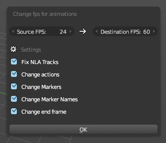

# Reflow

Reflow is Blender addon that lets you change the fps in a scene.
Instead of using time remapping, Reflow changes the animation data.
It offsets keyframes, markers and fixes NLA lenghts and the scene's endframe.

Time remapping makes timeline scrubbing weird and animations get cut because the
frame's end isn't updated. Changing the keyframes is more "permanent" but avoids
the wonkyness.

## Installing

1. Download the latest release using the Download button in this page
2. Open Blender's User Preferences (from the File menu or using Ctrl+Alt+U)
3. In the Addons tab, click the Install from File button at the bottom and select the zip you downloaded.
4. Now click the check the box next to the right of the addon to enable it, and click "Save user preferences" to make sure it's always enabled.

## Using

Open a blend file containing animations. Look for the *Dimensions* panel in
the render properties. Click the _"Change fps for animations"_ button.

A new dialog will popup with several settings, including the original fps
and the final fps. When you are done setting the options click the OK button
to run the script, to cancel just move your mouse away from the dialog.
